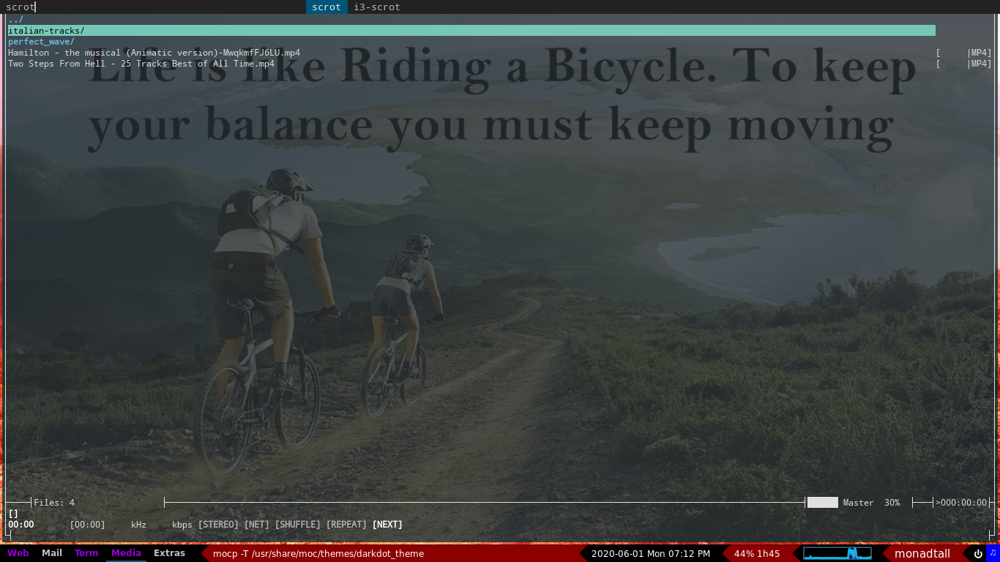

# CONFIG

This repository contains my computer config files :

	+ Neovim / Vim
	+ Tmux
	+ Bash / Zsh
	+ Xmodmap
	+ .config/
	+ .local/
	+ .xprofile
	+ memo.md

## .config

### qtile
	

1. Custom Keybindings :

- Super + p = mocp /usr/share/moc/themes/darkdot_theme
- Super + t = thunderbird
- Super + g = google-chrome-stable
- Super + q = qutebrowser
- Super + v = vlc
- Super + c = vim ~/.config/qtile/config.py
- Super + o = libreoffice
- Super + s = pavucontrol
- Super + r = ranger
- Super + b = broot
- Super + enter = termite

- Super + W = close a window
- Super + Ctrl + q = Quit Qtile
- Super + Ctrl + r = Restart Qtile
	
- Super + h
- Super + j
- Super + k
- Super + l
	
- Super + shift + h
- Super + shift + j
- Super + shift + k
- Super + shift + l

2. Layouts

- MonadTall()
- Max()

3. Widgets

- GroupBox
- window name
- Clock
- Battery
- Cpu Graph
- Layout name
- shutdown qtile 

### calcurse
### i3
### i3status
### neomutt
### polybar
### termite
### zshenv

## .local
	
### Scripts

	+ arch install
	+ battery info :
		Script getting the battery power & updating every 5 minutes
	+ mounting devices :
		Script for mounting usb keys. Not yet very flexible but does what it is needed for.	
	+ dmenu
	+ js
	+ py
	+ mystery : A small terminal game with various difficulty modes in which you must guess the number
	previously generated by the computer.
