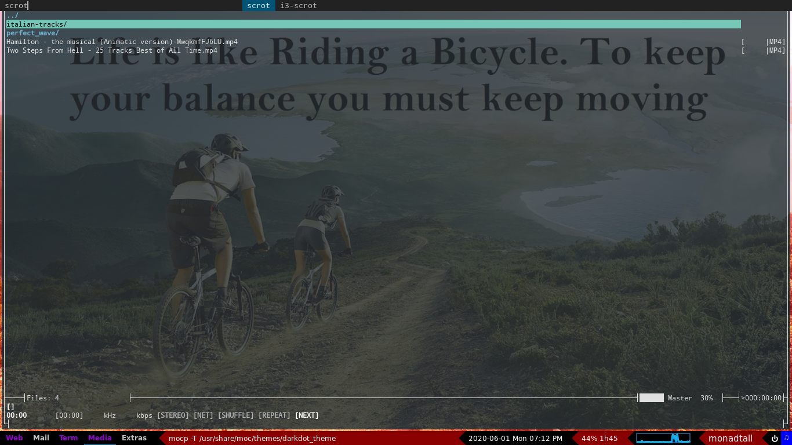

# MY LINUX DOTFILES

This repository contains all my linux config files :

	+ Neovim / Vim
	+ Tmux
	+ Bash / Zsh
	+ Xmodmap
	+ .config/
	+ .local/
	+ .xprofile

In this repository, I also regularly update a file :
	+ memo.md 
The aim of this file is to be some sort of wiki containing all
the issues I have had over the years and which I will have in the future.
There's not much in it for now but it will grow more and more over time.

## .config

### qtile
	

1. Custom Keybindings :

- Super + p = mocp /usr/share/moc/themes/darkdot_theme
- Super + t = thunderbird
- Super + g = google-chrome-stable
- Super + v = vlc
- Super + c = vim ~/.config/qtile/config.py
- Super + o = libreoffice
- Super + s = pavucontrol
- Super + r = ranger
- Super + b = broot
- Super + enter = termite

- Super + W = close a window
- Super + Ctrl + q = Quit Qtile
- Super + Ctrl + r = Restart Qtile
	
- Super + h
- Super + j
- Super + k
- Super + l
	
- Super + shift + h
- Super + shift + j
- Super + shift + k
- Super + shift + l

2. Layouts

- MonadTall()
- Max()

3. Widgets

- GroupBox
- window name
- Clock
- Battery
- Cpu Graph
- Layout name
- shutdown qtile 
- moc when turned on

### calcurse

### i3

- My i3 config isn't as customized as my qtile config. It is much like the
  default except for some minor things like vi keybindings (h,j,k,l), polybar
  and the transparency of the terminal window.

### i3status

### neomutt

- I am still working on my neomutt configuration. It currently works for one
  mailbox only and my ambition is to have it work for all my mailboxes (and I
  have quite a few).

### polybar

- Only the default configuration. No custom modification yet.

### termite

- I used a veyr helpful tool called termite-style to configure it. Here is the
  link to its github page : https://github.com/adi1090x/termite-style
- For arch users, I know you can install termite-style directly from the AUR.

### zshenv

### bash config

## .local
	
### Scripts

	+ arch install
	+ battery info :
		Script getting the battery power & updating every 5 minutes
	+ mounting devices :
		Script for mounting usb keys. Not yet very flexible but does what it is needed for.	
	+ dmenu
	+ js/ : javascript scripts
	+ py/ : python scripts 
	+ mystery : A small terminal game with various difficulty modes in which you must guess the number
	previously generated by the computer.
